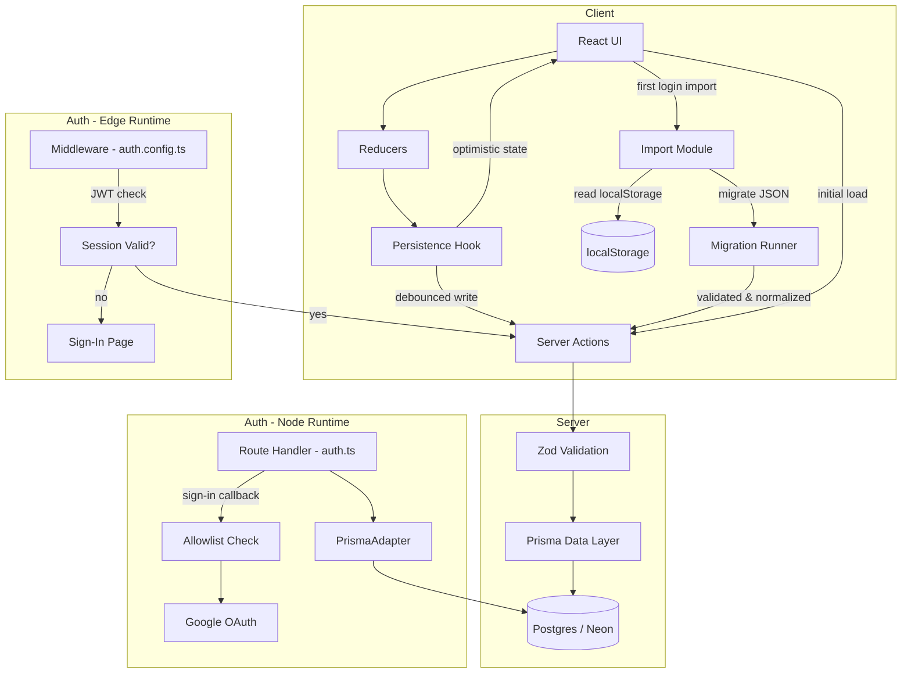

# Design Document: Multi-User Authentication

## Overview

This design converts plnrr from a single-user, localStorage-only Next.js application into a multi-user system with server-backed persistence. The key architectural changes are:

1. **Authentication layer** — Auth.js (NextAuth v5) with Google OAuth and the Prisma adapter handles identity, sessions, and route protection.
2. **Access control** — A server-side allowlist (parsed from `ALLOWED_EMAILS` env var) gates sign-in at the `signIn` callback.
3. **Data layer** — Prisma ORM with Postgres replaces localStorage as the canonical store. Every data query is scoped to the authenticated user's `userId`.
4. **Persistence service** — Server Actions replace the client-side `usePersistedReducer` hook. The client retains optimistic state with debounced writes and retry logic.
5. **Import path** — A one-time utility migrates existing localStorage data into the database on first login.

The existing UI, reducers, Zod schemas, and migration registry are preserved. The reducers continue to run client-side for optimistic updates; the persistence layer is swapped from localStorage to server writes.

## Architecture



### Request Flow

1. **Middleware** (`middleware.ts`) — Runs on the Edge runtime. Uses the lightweight `auth.config.ts` (no Prisma, no DB calls) to validate the JWT session token. Redirects unauthenticated requests to `/auth/signin`. Excludes `/auth/*`, `/api/auth/*`, and static assets.
2. **Auth Route Handler** (`src/app/api/auth/[...nextauth]/route.ts`) — Uses the full `auth.ts` with PrismaAdapter for OAuth callbacks, account linking, and user creation in Postgres.
3. **Server Actions** — Authenticated entry points for data reads/writes. Each action calls `auth()` (from the full config) to get the session, extracts `userId`, and passes it to the data layer.
4. **Data Layer** — Prisma queries always include a `where: { userId }` clause. No query path omits this filter. Data written to the database is always at the current schema version; no runtime migrations are applied on read/write.
5. **Client Persistence Hook** — Replaces `usePersistedReducer`. On mount, calls a Server Action to fetch initial state. On state change, debounces 500ms then calls a write Server Action. Retries on failure with exponential backoff.
6. **Import Module** (one-time) — When a user first logs in and has no server-side data, the Importer reads localStorage JSON, applies the Migration Runner to bring it to the current schema version, validates via Zod, then writes the normalized data to Postgres. The Migration Runner is **only** invoked during this import path — not on subsequent reads/writes.

## Components and Interfaces

### Auth Configuration — Split Config Pattern

Auth.js is split into two configs to handle the Edge runtime constraint (middleware cannot use Prisma):

#### Lightweight Edge Config (`src/lib/auth.config.ts`)

Used **only** by the middleware. No Prisma, no DB calls. Runs on Edge runtime.

```typescript
import type { NextAuthConfig } from "next-auth";
import Google from "next-auth/providers/google";
import { parseAllowlist, isEmailAllowed } from "@/lib/allowlist";

export const authConfig: NextAuthConfig = {
  providers: [Google],
  session: { strategy: "jwt", maxAge: 30 * 24 * 60 * 60 }, // 30 days, JWT-based
  pages: { signIn: "/auth/signin", error: "/auth/signin" },
  callbacks: {
    authorized({ auth }) {
      return !!auth?.user; // middleware gate: is there a valid JWT?
    },
    signIn({ user }) {
      const allowlist = parseAllowlist(process.env.ALLOWED_EMAILS);
      if (allowlist.length === 0) return false;
      return isEmailAllowed(user.email, allowlist);
    },
  },
};
```

#### Full Server Config (`src/lib/auth.ts`)

Used by Server Actions, route handlers, and the Auth.js API route. Includes PrismaAdapter for user/account persistence. Runs on Node runtime only.

```typescript
import NextAuth from "next-auth";
import { PrismaAdapter } from "@auth/prisma-adapter";
import { prisma } from "@/lib/prisma";
import { authConfig } from "@/lib/auth.config";

export const { handlers, auth, signIn, signOut } = NextAuth({
  ...authConfig,
  adapter: PrismaAdapter(prisma),
  callbacks: {
    ...authConfig.callbacks,
    session({ session, token }) {
      // Attach userId from JWT to session object for Server Actions
      if (token?.sub) session.user.id = token.sub;
      return session;
    },
  },
});
```

**Why JWT strategy?** With `strategy: "jwt"`, the session token is a signed JWT stored in a cookie. The Edge middleware can validate it cryptographically without querying Postgres on every request. The PrismaAdapter still handles user/account creation during OAuth sign-in, but session reads are stateless.

### Allowlist Module (`src/lib/allowlist.ts`)

```typescript
/** Parse comma-separated email allowlist, trimming whitespace, lowercasing. */
export function parseAllowlist(raw: string | undefined): string[] {
  if (!raw || raw.trim() === "") return [];
  return raw.split(",").map((e) => e.trim().toLowerCase()).filter(Boolean);
}

/** Check if an email is in the allowlist (case-insensitive). */
export function isEmailAllowed(
  email: string | null | undefined,
  allowlist: string[]
): boolean {
  if (!email) return false;
  return allowlist.includes(email.toLowerCase());
}
```

### Prisma Client Singleton (`src/lib/prisma.ts`)

```typescript
import { PrismaClient } from "@prisma/client";

const globalForPrisma = globalThis as unknown as { prisma: PrismaClient };

export const prisma =
  globalForPrisma.prisma || new PrismaClient();

if (process.env.NODE_ENV !== "production") globalForPrisma.prisma = prisma;
```

### Middleware (`middleware.ts`)

Uses the lightweight Edge-compatible config (no Prisma). Validates the JWT session token without any DB call.

```typescript
import NextAuth from "next-auth";
import { authConfig } from "@/lib/auth.config";

export const { auth: middleware } = NextAuth(authConfig);

export const config = {
  matcher: [
    // Protect everything except auth routes, API auth routes, and static files
    "/((?!auth|api/auth|_next/static|_next/image|favicon.ico|.*\\.svg$).*)",
  ],
};
```

### Server Actions (`src/lib/actions.ts`)

Server Actions handle all authenticated data reads/writes. They use the full `auth.ts` config (Node runtime) to access the session. **No migration runner is invoked here** — data in Postgres is always at the current schema version.

```typescript
"use server";

import { auth } from "@/lib/auth";
import { prisma } from "@/lib/prisma";
import { ChecklistStateSchema, OrganizerStateSchema } from "@/lib/schemas";

export async function loadUserData() {
  const session = await auth();
  if (!session?.user?.id) throw new Error("Unauthorized");
  const userId = session.user.id;
  // Fetch checklist + organizer data scoped to userId
  // Data is always at current schema version (no migrations needed)
  // Return both states
}

export async function saveChecklistState(payload: unknown) {
  const session = await auth();
  if (!session?.user?.id) throw new Error("Unauthorized");
  const result = ChecklistStateSchema.safeParse(payload);
  if (!result.success) return { error: formatZodError(result.error) };
  // Write to DB scoped to userId
}

export async function saveOrganizerState(payload: unknown) {
  const session = await auth();
  if (!session?.user?.id) throw new Error("Unauthorized");
  const result = OrganizerStateSchema.safeParse(payload);
  if (!result.success) return { error: formatZodError(result.error) };
  // Write to DB scoped to userId
}

export async function importUserData(checklistData: unknown, organizerData: unknown) {
  const session = await auth();
  if (!session?.user?.id) throw new Error("Unauthorized");

  // Server-side validation — never trust the client payload
  const checklistResult = ChecklistStateSchema.safeParse(checklistData);
  if (!checklistResult.success) return { error: formatZodError(checklistResult.error), dataset: "checklist" };

  const organizerResult = OrganizerStateSchema.safeParse(organizerData);
  if (!organizerResult.success) return { error: formatZodError(organizerResult.error), dataset: "organizer" };

  // Normalize validated data into relational shape and write to Postgres
  // Set importCompleted flag on user
}
```

### Server-Backed Persistence Hook (`src/lib/use-server-persisted-reducer.ts`)

Replaces `usePersistedReducer` for authenticated users:

```typescript
export function useServerPersistedReducer<S, A>(
  reducer: Reducer<S, A>,
  defaultValue: S,
  config: { saveFn: (state: S) => Promise<SaveResult> }
): { state: S; dispatch: Dispatch<A>; error: PersistenceError | null; loading: boolean }
```

- On mount: calls `loadUserData()` Server Action, shows loading skeleton
- On state change: debounces 500ms, calls `saveFn`
- On failure: retries with exponential backoff (1s, 2s, 4s), max 3 attempts
- On all retries exhausted: shows persistent error notification

### User Display Helper (`src/lib/user-display.ts`)

```typescript
/** Format user display name for navigation. Prefers name, falls back to email, truncates at 30 chars. */
export function formatUserDisplay(name?: string | null, email?: string | null): string {
  const display = name || email || "User";
  return display.length > 30 ? display.slice(0, 30) + "…" : display;
}
```

### Import Module (`src/lib/importer.ts`)

Client-side module and the **sole consumer of the Migration Runner**. The import path is the only place where legacy versioned JSON is encountered; once data is written to Postgres it's always at the current schema version.

1. Checks if user has zero templates and zero tasks (via Server Action)
2. Checks if import-completed flag is set
3. If eligible, reads `plnrr:checklist` and `plnrr:organizer` from localStorage
4. Applies the Migration Runner to bring each JSON blob from its stored version to the current version
5. Validates migrated data against Zod schemas
6. Normalizes the JSON into the relational shape expected by Prisma (e.g., denormalized `Template` → `ChecklistTemplate` + `ChecklistCategory` + `ChecklistItem`)
7. Writes to server via `importUserData` Server Action
8. Persists import-completed flag

**Why client-side migrations?** The localStorage data is only available in the browser. The migration functions operate on the same JSON shape they always have. Running migrations client-side before sending to the server avoids serializing legacy shapes across the network and keeps the Server Actions simple.

### Sign-In Page (`src/app/auth/signin/page.tsx`)

Server Component that renders:
- Google sign-in button (calls `signIn("google")`)
- Error messages for access-denied or OAuth errors (read from URL search params)

## Data Models

### Prisma Schema

```prisma
datasource db {
  provider  = "postgresql"
  url       = env("DATABASE_URL")
  directUrl = env("DIRECT_URL") // non-pooled connection for migrations
}

generator client {
  provider = "prisma-client-js"
}

// === Auth.js Required Models ===

model User {
  id            String    @id @default(cuid())
  name          String?
  email         String?   @unique
  emailVerified DateTime?
  image         String?
  accounts      Account[]
  sessions      Session[]

  // Application data
  checklistTemplates ChecklistTemplate[]
  activeChecklist    ActiveChecklist?
  taskCards          TaskCard[]
  importCompleted    Boolean @default(false)
}

model Account {
  id                String  @id @default(cuid())
  userId            String
  type              String
  provider          String
  providerAccountId String
  refresh_token     String? @db.Text
  access_token      String? @db.Text
  expires_at        Int?
  token_type        String?
  scope             String?
  id_token          String? @db.Text
  session_state     String?

  user User @relation(fields: [userId], references: [id], onDelete: Cascade)

  @@unique([provider, providerAccountId])
}

model Session {
  id           String   @id @default(cuid())
  sessionToken String   @unique
  userId       String
  expires      DateTime

  user User @relation(fields: [userId], references: [id], onDelete: Cascade)
}

model VerificationToken {
  identifier String
  token      String
  expires    DateTime

  @@unique([identifier, token])
}

// === Application Models ===

model ChecklistTemplate {
  id         String   @id @default(cuid())
  name       String   @db.VarChar(100)
  nameLower  String   @db.VarChar(100) // generated lowercase shadow column for CI uniqueness
  createdAt  DateTime @default(now())
  userId     String

  user       User                @relation(fields: [userId], references: [id], onDelete: Cascade)
  categories ChecklistCategory[]
  items      ChecklistItem[]
  activeChecklist ActiveChecklist?

  @@unique([userId, nameLower], map: "checklist_template_user_name_ci_unique")
}

model ChecklistCategory {
  id         String @id @default(cuid())
  name       String @db.VarChar(50)
  order      Int
  templateId String

  template ChecklistTemplate @relation(fields: [templateId], references: [id], onDelete: Cascade)
  items    ChecklistItem[]
}

model ChecklistItem {
  id            String  @id @default(cuid())
  text          String  @db.VarChar(200)
  minutesBefore Int?
  templateId    String
  categoryId    String

  template ChecklistTemplate @relation(fields: [templateId], references: [id], onDelete: Cascade)
  category ChecklistCategory @relation(fields: [categoryId], references: [id], onDelete: Cascade)
}

model ActiveChecklist {
  id         String  @id @default(cuid())
  userId     String  @unique
  templateId String  @unique
  streamTime String?
  items      Json    // ActiveChecklistItem[] stored as JSON

  user     User              @relation(fields: [userId], references: [id], onDelete: Cascade)
  template ChecklistTemplate @relation(fields: [templateId], references: [id], onDelete: Cascade)
}

model TaskCard {
  id        String   @id @default(cuid())
  title     String   @db.VarChar(100)
  weekday   String   // enum stored as string
  typeTag   String?  // nullable enum stored as string
  completed Boolean  @default(false)
  recurring Boolean  @default(false)
  createdAt DateTime @default(now())
  userId    String

  user User @relation(fields: [userId], references: [id], onDelete: Cascade)
}
```

### State Mapping

The existing client-side state shapes map to the database as follows:

| Client State | DB Model | Notes |
|---|---|---|
| `Template` | `ChecklistTemplate` + `ChecklistCategory` + `ChecklistItem` | Denormalized in client, normalized in DB |
| `ActiveChecklist` | `ActiveChecklist` (items as JSON) | Items stored as JSON blob for simplicity |
| `TaskCard` | `TaskCard` | 1:1 mapping |

### Design Decisions

#### Case-Insensitive Template Name Uniqueness

The `ChecklistTemplate` model uses a **shadow column approach** (`nameLower`) for case-insensitive uniqueness:

- A `nameLower` column stores `name.toLowerCase()` and carries the unique constraint `@@unique([userId, nameLower])`.
- The application layer (Server Actions) is responsible for populating `nameLower = name.toLowerCase()` on every create/update.
- The original `name` column preserves the user's casing for display.

**Tradeoffs considered:**
- *`citext` extension*: Requires enabling the `citext` Postgres extension. Neon supports it, but it's not natively expressible in Prisma's schema — you'd need `@db.Citext` which isn't a built-in Prisma type. Also makes the collation implicit, which can surprise developers.
- *Shadow column* (chosen): Explicit, works with vanilla Prisma, no extension dependencies, portable across Postgres providers. Slight write overhead (computing lowercase), but template mutations are infrequent.
- *Functional index*: `CREATE UNIQUE INDEX ... ON "ChecklistTemplate" (("userId"), lower("name"))` — ideal in raw SQL but not expressible in Prisma schema syntax without a raw migration. Could be added later if shadow column proves cumbersome.

**Keeping `nameLower` in sync — Prisma Client Extension recommendation:**

A Prisma Client Extension with a `query` hook on `checklistTemplate.create` and `checklistTemplate.update` should auto-derive `nameLower` from `name` before the query hits Postgres. This ensures every write path — including `importUserData`, future admin tools, or seed scripts — gets the correct lowercase value without relying on each call site to remember. The extension is low-cost to implement (roughly 15 lines) and eliminates the class of bug where a new code path forgets to set `nameLower`. Recommended for inclusion in the implementation tasks.

```typescript
// src/lib/prisma.ts (extension excerpt)
const prismaWithExtensions = prisma.$extends({
  query: {
    checklistTemplate: {
      async create({ args, query }) {
        if (args.data.name) args.data.nameLower = args.data.name.toLowerCase();
        return query(args);
      },
      async update({ args, query }) {
        if (args.data.name) {
          const name = typeof args.data.name === "string" ? args.data.name : args.data.name.set;
          if (name) args.data.nameLower = name.toLowerCase();
        }
        return query(args);
      },
      async createMany({ args, query }) {
        const data = Array.isArray(args.data) ? args.data : [args.data];
        data.forEach((d) => { if (d.name) d.nameLower = d.name.toLowerCase(); });
        return query(args);
      },
    },
  },
});
```

#### Migration Runner Scope

The Migration Runner is **only** invoked during the one-time localStorage import. Rationale:

- The Prisma schema defines a normalized relational structure — not a single JSON blob with a version field.
- Once data is written to Postgres via the normalized schema, future schema evolution is handled by **Prisma migrations** (`prisma migrate deploy`), not the application-level Migration Runner.
- The existing `migrations.ts` functions operate on the denormalized JSON shapes (`ChecklistState`, `OrganizerState`) that localStorage stores. They don't know about relational tables.
- Therefore: localStorage JSON → Migration Runner (version up) → Zod validation → normalize to relational shape → write to Postgres. After that, data is always at the current version.

### Environment Variables

| Variable | Purpose |
|---|---|
| `DATABASE_URL` | Postgres connection string via Neon's connection pooler (used at runtime by Prisma Client for queries) |
| `DIRECT_URL` | Direct (non-pooled) Postgres connection string (used by `prisma migrate deploy` and `prisma db push`, which don't work reliably through Neon's pooler) |
| `AUTH_SECRET` | Auth.js signing secret (used to sign/verify JWT session tokens) |
| `AUTH_GOOGLE_ID` | Google OAuth client ID |
| `AUTH_GOOGLE_SECRET` | Google OAuth client secret |
| `ALLOWED_EMAILS` | Comma-separated allowlist of approved email addresses |

## Correctness Properties

*A property is a characteristic or behavior that should hold true across all valid executions of a system — essentially, a formal statement about what the system should do. Properties serve as the bridge between human-readable specifications and machine-verifiable correctness guarantees.*

### Property 1: Allowlist email matching is case-insensitive and correct

*For any* email string and any allowlist of emails, `isEmailAllowed(email, allowlist)` returns `true` if and only if the lowercase form of the email exactly matches some entry in the lowercase-normalized allowlist.

**Validates: Requirements 2.1, 2.2**

### Property 2: Allowlist parsing produces trimmed, lowercased entries

*For any* comma-separated string of email addresses (possibly containing leading/trailing whitespace around entries), `parseAllowlist` produces an array where each element equals the corresponding input segment trimmed of whitespace and lowercased, with empty segments removed.

**Validates: Requirements 2.3**

### Property 3: Data isolation by userId

*For any* set of users with distinct `userId` values and any data written by user A, a data query executed with user B's `userId` shall never return records belonging to user A.

**Validates: Requirements 3.7, 4.7**

### Property 4: Zod validation rejects invalid payloads with field-level errors

*For any* payload that does not conform to `ChecklistStateSchema` or `OrganizerStateSchema`, all write Server Actions (`saveChecklistState`, `saveOrganizerState`, and `importUserData`) shall reject the write without invoking the Data_Layer, and the returned error shall list at least one field path that failed validation along with a human-readable reason. This applies regardless of whether the client performed its own validation — the server never trusts incoming payloads.

**Validates: Requirements 4.6, 5.3**

### Property 5: Migration chain version correctness (import-time only)

*For any* valid localStorage JSON object at schema version V and any migration registry with current version C: if V < C, then `runMigrations(data, V, registry)` produces output with version equal to C; if V >= C, the output is identical to the input. This property applies exclusively during the one-time localStorage import — data in Postgres is always at the current version and never passes through the Migration Runner.

**Validates: Requirements 6.1, 6.5**

### Property 6: Migration failure atomicity (import-time only)

*For any* migration chain applied during localStorage import where migration step K throws an exception, no data from that import shall be written to the database, and the import shall report which version transition failed. The localStorage data remains available for retry.

**Validates: Requirements 6.4**

### Property 7: Import data migration + validation round-trip

*For any* valid checklist or organizer state stored in localStorage at any historical schema version, applying the migration chain and then validating against the current Zod schema shall produce a valid state object at the current version with all original data preserved (modulo additive field defaults).

**Validates: Requirements 7.3**

### Property 8: Route redirect preserves callbackUrl

*For any* protected route path requested by an unauthenticated user, the redirect response shall include the original path as a `callbackUrl` query parameter on the sign-in page URL, enabling post-authentication return to the originally requested page.

**Validates: Requirements 8.2**

### Property 9: User display name formatting and truncation

*For any* user name string (or null) and email string (or null), `formatUserDisplay` shall return the name if non-null and non-empty, otherwise the email, otherwise "User"; and the result shall never exceed 30 characters, with an ellipsis appended when truncation occurs.

**Validates: Requirements 9.1**

## Error Handling

### Authentication Errors

| Scenario | Behavior |
|---|---|
| OAuth error / user cancels | Redirect to `/auth/signin?error=OAuthError` with user-facing message |
| Email not in allowlist | Redirect to `/auth/signin?error=AccessDenied` with access-denied message |
| `ALLOWED_EMAILS` missing/empty | Reject all sign-ins, log config error server-side |
| Session expired mid-use | Next request triggers redirect to sign-in (page routes) or 401 (API routes) |
| Sign-out failure | Toast error, keep session intact, allow retry |

### Persistence Errors

| Scenario | Behavior |
|---|---|
| Initial load timeout (10s) | Error notification with retry button |
| Initial load failure | Error notification with retry button |
| Write failure | Toast notification, retry with exponential backoff (1s → 2s → 4s) |
| All 3 retries exhausted | Persistent error banner, state retained in memory for session duration |
| Zod validation failure | Reject write silently (malformed state indicates a bug, log to console) |

### Import Errors

| Scenario | Behavior |
|---|---|
| No localStorage data | Inform user, disable prompt permanently |
| One dataset fails validation | Import valid dataset, show error for failed one, allow retry/skip |
| Write failure during import | Allow up to 3 retries, then offer skip only |
| Skip chosen | Persist import-completed flag, never prompt again |

## Testing Strategy

### Property-Based Tests (fast-check, minimum 100 iterations each)

The following correctness properties will be tested using `fast-check` (already a project dependency):

| Property | Module Under Test | Generators |
|---|---|---|
| 1: Allowlist matching | `src/lib/allowlist.ts` | Random email strings, random allowlists |
| 2: Allowlist parsing | `src/lib/allowlist.ts` | Random comma-separated strings with whitespace |
| 3: Data isolation | `src/lib/actions.ts` (mocked Prisma) | Random user IDs, random data sets |
| 4: Zod rejection | `src/lib/actions.ts` | Invalid state payloads generated by mutating valid ones |
| 5: Migration chain (import) | `src/lib/migrations.ts` | Random localStorage JSON at various versions |
| 6: Migration atomicity (import) | `src/lib/migrations.ts` | Migration chains with injected failures |
| 7: Import round-trip | `src/lib/importer.ts` | Valid states at old versions |
| 9: Display formatting | `src/lib/user-display.ts` | Random strings of varying length |

Property 8 (callbackUrl) is better suited to an integration test with the middleware since it depends on Auth.js internals and Next.js request handling.

Each property test file will be tagged:
```
// Feature: multi-user-auth, Property {N}: {title}
```

### Unit Tests (example-based)

- Auth callback: allowlist rejection, OAuth error handling, missing env var behavior
- Server Actions: unauthorized access returns error, valid writes succeed
- Persistence hook: debounce timing, retry count, loading states
- Import flow: empty localStorage, partial success, skip behavior
- Sign-in page: renders Google button, displays error params

### Integration Tests

- Prisma cascade deletes (user deletion removes all data)
- Full sign-in flow with mocked Google provider
- Middleware redirect behavior for protected vs public routes
- Server Action end-to-end with test database

### Build Verification

- `next build` succeeds with all env vars defined (CI smoke test)
- Prisma migration applies cleanly to empty database
