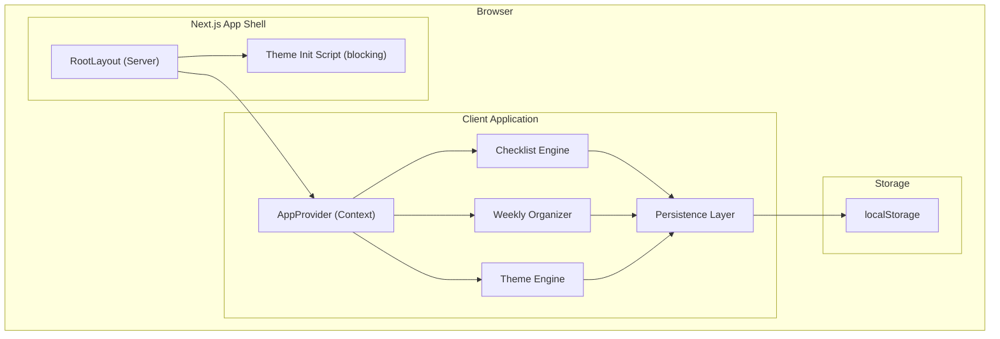
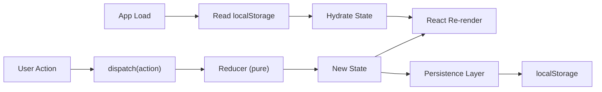
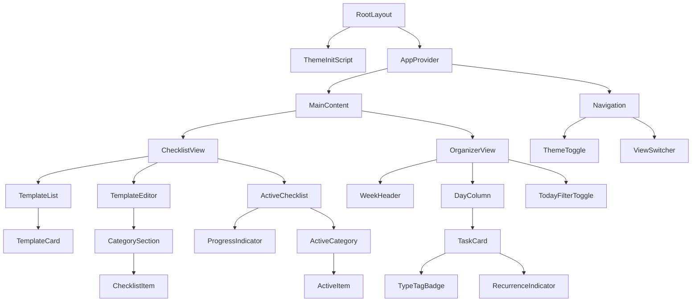

# Design Document: Stream Prep

## Overview

Stream Prep is a greenfield Next.js application providing two productivity tools for content creators: a **Checklist Engine** (reusable pre-stream checklist templates with active session tracking) and a **Weekly Organizer** (perpetual weekday-based task board with type tagging and recurrence). The app is entirely client-side with localStorage persistence, dark-mode-first theming, and a responsive layout optimized for quick glanceability.

### Key Design Decisions

| Decision | Rationale |
|----------|-----------|
| Next.js App Router with `"use client"` boundary at layout level | Entire app requires browser APIs (localStorage, timezone). Server rendering provides fast initial shell; all interactive content is client-rendered. |
| React Context + useReducer for state | Predictable state transitions, easy to serialize, no external dependency. Redux/Zustand overkill for localStorage-only app. |
| Separate localStorage keys per domain | Avoids monolithic writes, reduces conflict surface, enables independent versioning. |
| Perpetual weekday model (no dates) | Simplifies data model — tasks are assigned to "Monday" not "2024-01-15". Reset logic keyed off `lastResetTimestamp`. |
| Class-based dark mode (`darkMode: "class"`) | Matches Tailwind's class strategy; enables SSR-safe initial render with `dark` class pre-applied via a blocking script. |
| Custom Tailwind palette tokens | Maps lavender/pink/mint/amber to CSS variables so theme colors propagate through both light and dark modes. |

---

## Architecture

### High-Level Architecture



### Rendering Strategy

1. **Server**: `RootLayout` renders the HTML shell with a blocking `<script>` that reads `localStorage.getItem("theme")` and applies the `dark` class before paint (prevents flash).
2. **Client**: A single `"use client"` boundary at `AppProvider` level. All UI below this is client-rendered React, hydrating after the shell loads.
3. **No API routes**: Zero backend. All state is in localStorage.

### State Flow



---

## Components and Interfaces

### Component Hierarchy



### Key Component Responsibilities

| Component | Responsibility |
|-----------|---------------|
| `AppProvider` | Wraps app in Context providers, initializes state from localStorage, triggers recurrence reset check on mount |
| `TemplateList` | Renders list of templates, handles create/delete/select actions, renders empty state |
| `TemplateEditor` | CRUD for categories and items within a selected template |
| `ActiveChecklist` | Renders loaded checklist instance, handles check/uncheck/reset, shows ProgressIndicator |
| `ProgressIndicator` | Computes and displays `{checked}/{total} complete`, visual completion state |
| `OrganizerView` | Renders 7-day grid (or filtered single-day), manages task CRUD |
| `DayColumn` | Renders tasks for one weekday, handles add task, enforces 50-item limit |
| `TaskCard` | Displays single task with type tag color, completion styling, recurrence badge |
| `ThemeToggle` | Button to switch dark/light, persists preference |
| `TodayFilterToggle` | Activates/deactivates today-only view |

### Navigation Model

The app uses a **tab-based** single-page layout with two primary views:
- **Checklist** tab — Template management + active checklist
- **Weekly** tab — Organizer board

Navigation state is managed via React state (not URL routing) to keep it fast and avoid hydration complexity.

---

## Data Models

### localStorage Schema

```
localStorage keys:
├── "plnrr:checklist"    → ChecklistState (JSON)
├── "plnrr:organizer"   → OrganizerState (JSON)
├── "plnrr:theme"       → "dark" | "light"
└── "plnrr:lastReset"   → ISO 8601 timestamp string
```

### Core TypeScript Interfaces

```typescript
// === Checklist Domain ===

interface ChecklistItem {
  id: string;           // nanoid
  text: string;         // 1–200 chars
  categoryId: string;   // reference to Category.id
}

interface Category {
  id: string;           // nanoid
  name: string;         // 1–50 chars
  order: number;        // display order within template
}

interface Template {
  id: string;           // nanoid
  name: string;         // 1–100 chars, unique (case-insensitive)
  categories: Category[];
  items: ChecklistItem[];  // max 50
  createdAt: string;    // ISO 8601
}

interface ActiveChecklist {
  templateId: string;        // source template reference
  items: ActiveChecklistItem[];
}

interface ActiveChecklistItem {
  id: string;           // mirrors ChecklistItem.id
  text: string;         // copied from template at load time
  categoryId: string;
  checked: boolean;
}

interface ChecklistState {
  version: number;      // schema version for migrations
  templates: Template[];
  activeChecklist: ActiveChecklist | null;
}

// === Organizer Domain ===

type Weekday = 'monday' | 'tuesday' | 'wednesday' | 'thursday' | 'friday' | 'saturday' | 'sunday';

type TypeTag = 'stream-day' | 'content-planning' | 'admin-business' | 'editing';

interface TaskCard {
  id: string;           // nanoid
  title: string;        // 1–100 chars
  weekday: Weekday;
  typeTag: TypeTag | null;
  completed: boolean;
  recurring: boolean;
  createdAt: string;    // ISO 8601
}

interface OrganizerState {
  version: number;      // schema version for migrations
  tasks: TaskCard[];    // max 50 per weekday (enforced at write time)
}

// === Theme ===

type ThemePreference = 'dark' | 'light';
```

### Recurrence Reset Logic

```typescript
/**
 * Called on app initialization (useEffect in AppProvider).
 * Determines if a Monday 00:00 boundary has been crossed since the last reset.
 */
function shouldResetRecurringTasks(lastResetTimestamp: string | null): boolean {
  const now = new Date();
  const lastReset = lastResetTimestamp ? new Date(lastResetTimestamp) : null;
  
  if (!lastReset) return true; // First load ever — reset everything
  
  // Find the most recent Monday 00:00:00 local time
  const mostRecentMonday = getMostRecentMonday(now);
  
  // If the last reset was before the most recent Monday, we need to reset
  return lastReset < mostRecentMonday;
}

function getMostRecentMonday(from: Date): Date {
  const d = new Date(from);
  const day = d.getDay(); // 0=Sun, 1=Mon, ...
  const diff = day === 0 ? 6 : day - 1; // days since last Monday
  d.setDate(d.getDate() - diff);
  d.setHours(0, 0, 0, 0);
  return d;
}

function resetRecurringTasks(state: OrganizerState): OrganizerState {
  return {
    ...state,
    tasks: state.tasks.map(task =>
      task.recurring ? { ...task, completed: false } : task
    ),
  };
}
```

### Persistence Layer Design

```typescript
interface PersistenceConfig {
  key: string;
  version: number;
  schema: ZodSchema;  // runtime validation
  migrate: (data: unknown, fromVersion: number) => unknown;
}

// Generic persistence hook
function usePersistedState<T>(config: PersistenceConfig, defaultValue: T): {
  state: T;
  dispatch: Dispatch<Action>;
  error: PersistenceError | null;
}
```

The persistence layer:
1. **Reads** on mount: parse JSON → validate with Zod schema → migrate if version mismatch → strip unknown fields → apply defaults for missing fields
2. **Writes** on state change: serialize → attempt `localStorage.setItem` → catch quota errors → surface non-blocking warning if write fails
3. **Debounces** writes by 100ms to batch rapid state changes (e.g., multiple quick checkbox toggles)

### Validation Rules

| Field | Constraint | Enforcement |
|-------|-----------|-------------|
| Template name | 1–100 chars, unique (case-insensitive) | Reducer rejects action, UI shows error |
| Category name | 1–50 chars, unique within template | Reducer rejects action, UI shows error |
| Task title | 1–100 chars, non-whitespace-only | Reducer rejects action, UI shows error |
| Items per template | Max 50 | Reducer rejects add action |
| Tasks per weekday | Max 50 | Reducer rejects add action |
| Theme preference | "dark" \| "light" | Falls back to "dark" if invalid |

---

## Correctness Properties

*A property is a characteristic or behavior that should hold true across all valid executions of a system — essentially, a formal statement about what the system should do. Properties serve as the bridge between human-readable specifications and machine-verifiable correctness guarantees.*

### Property 1: Progress Indicator Invariant

*For any* Active_Checklist instance with any combination of checked and unchecked items, the Progress_Indicator SHALL display exactly `"{K}/{N} complete"` where K equals the count of items with `checked === true` and N equals the total item count, regardless of the order of check/uncheck operations performed.

**Validates: Requirements 3.2, 3.3, 3.4, 3.9**

### Property 2: Persistence Round-Trip

*For any* valid application state (ChecklistState or OrganizerState), serializing the state to JSON and then deserializing it SHALL produce an object deeply equal to the original state.

**Validates: Requirements 8.4**

### Property 3: Reset Idempotence

*For any* Active_Checklist instance in any check state, applying the reset operation once SHALL produce an identical result to applying it multiple times: `reset(checklist) === reset(reset(checklist))`.

**Validates: Requirements 3.6**

### Property 4: Template Isolation

*For any* template T and its loaded Active_Checklist instance A, any sequence of check, uncheck, or reset operations applied to A SHALL leave T's items, categories, and name unchanged (deep equality before and after).

**Validates: Requirements 3.6, 3.8**

### Property 5: Task Count Metamorphic

*For any* weekly organizer state with N total tasks, adding one valid task SHALL result in exactly N+1 total tasks, and deleting one task SHALL result in exactly N-1 total tasks. Applying the Today filter SHALL return a task count less than or equal to N.

**Validates: Requirements 4.1, 4.4, 6.1**

### Property 6: Category Deletion Item Preservation

*For any* template with items distributed across categories, deleting any non-"Other" category SHALL preserve the total item count, with the deleted category's items appearing appended to the "Other" category.

**Validates: Requirements 2.6**

### Property 7: Recurring Task Reset

*For any* set of tasks where some subset has `recurring === true` in any completion state, executing the recurring reset operation SHALL set `completed` to `false` on all recurring tasks while leaving non-recurring tasks unchanged.

**Validates: Requirements 7.2, 7.5**

### Property 8: Name Validation Boundary

*For any* string S: template creation SHALL succeed if and only if `1 <= S.trim().length <= 100` and no existing template has a case-insensitive name match. Task creation SHALL succeed if and only if `S.trim().length >= 1` and `S.trim().length <= 100`.

**Validates: Requirements 1.1, 1.2, 1.5, 4.1, 4.2**

### Property 9: Active Checklist Loading

*For any* template T, loading T as an Active_Checklist SHALL produce an instance where every item has `checked === false`, the item count equals T's item count, and item text values match T's items exactly.

**Validates: Requirements 3.1, 3.8**

### Property 10: Schema Migration Forward-Compatibility

*For any* valid persisted state object augmented with arbitrary additional unknown fields, loading and re-persisting SHALL discard unknown fields, preserve all recognized fields with their original values, and apply default values for any fields present in the current schema but absent in the stored data.

**Validates: Requirements 8.7**

---

## Error Handling

### Error Categories and Responses

| Error | Source | Response | User Impact |
|-------|--------|----------|-------------|
| localStorage unavailable | Browser (private mode, disabled) | Retain in-memory state, show non-blocking toast | Full functionality, no persistence across reloads |
| Storage quota exceeded | localStorage (>5MB) | Show warning toast, retain in-memory state | Can continue working, saves fail silently |
| Corrupted/invalid stored data | localStorage read on load | Initialize with empty defaults, show info toast | Starts fresh, old data lost |
| Validation failure (name too long, duplicate) | User input | Inline error message below input field | Blocked from saving until corrected |
| Capacity limit reached (50 items/tasks) | User action | Inline error message, disable add button | Cannot add more until items removed |
| Timezone unavailable | Browser API | Disable Today filter, show info message | All other features work normally |

### Error Display Strategy

- **Non-blocking toasts**: For persistence warnings that don't prevent continued use (auto-dismiss after 5s)
- **Inline validation errors**: For form input violations (adjacent to the field, red text in both themes)
- **Disabled affordances**: For capacity limits (grayed-out add buttons with tooltip explaining limit)

### Graceful Degradation

The app follows a "best-effort persistence" model:
1. All operations succeed in-memory regardless of localStorage state
2. Persistence failures are surfaced but never block interaction
3. On load, corrupted data is discarded rather than crashing — the user starts fresh with a warning

---

## Testing Strategy

### Testing Framework

- **Unit tests**: Vitest (fast, TypeScript-native, compatible with Next.js)
- **Property-based tests**: [fast-check](https://github.com/dubzzz/fast-check) (mature PBT library for TypeScript)
- **Component tests**: React Testing Library + Vitest
- **E2E tests**: Playwright (responsive breakpoint testing, visual regression)

### Dual Testing Approach

**Property-Based Tests (fast-check)**:
- Minimum 100 iterations per property
- Each test tagged with: `// Feature: stream-prep, Property {N}: {title}`
- Target the pure reducer/logic layer — no DOM, no localStorage mocking
- Generators produce: random templates (1–50 items, 1–10 categories), random tasks (valid titles, all weekdays, all tag combinations), random operation sequences

**Unit Tests (Vitest)**:
- Specific examples and edge cases
- localStorage mock tests (unavailable, quota exceeded, corrupted data)
- Theme toggle behavior
- Empty state rendering
- Responsive breakpoint assertions (via container queries or matchMedia mocking)
- Capacity limit enforcement at boundaries (49 → 50 → reject)

**Component Tests (React Testing Library)**:
- User interaction flows (create template → add items → load → check off)
- Accessibility: ARIA labels, keyboard navigation, focus management
- Visual states (completion styling, type tag colors, recurring badges)

**E2E Tests (Playwright)**:
- Full user journeys across viewport sizes
- Persistence across page reloads
- CLS measurement via Performance Observer
- Today filter with mocked system clock

### Property Test Configuration

```typescript
import fc from 'fast-check';

// All property tests use at minimum 100 runs
const PBT_CONFIG = { numRuns: 100 };

// Example property test structure:
// Feature: stream-prep, Property 1: Progress Indicator Invariant
test('progress indicator always equals checked count', () => {
  fc.assert(
    fc.property(
      arbitraryActiveChecklist(), 
      arbitraryCheckOperations(),
      (checklist, operations) => {
        const result = applyOperations(checklist, operations);
        const checked = result.items.filter(i => i.checked).length;
        const total = result.items.length;
        expect(formatProgress(result)).toBe(`${checked}/${total} complete`);
      }
    ),
    PBT_CONFIG
  );
});
```

### Test Organization

```
tests/
├── properties/           # Property-based tests (fast-check)
│   ├── checklist.property.test.ts
│   ├── organizer.property.test.ts
│   └── persistence.property.test.ts
├── unit/                 # Unit tests
│   ├── checklist-reducer.test.ts
│   ├── organizer-reducer.test.ts
│   ├── persistence.test.ts
│   ├── recurrence.test.ts
│   └── validation.test.ts
├── components/           # Component tests
│   ├── TemplateList.test.tsx
│   ├── ActiveChecklist.test.tsx
│   ├── DayColumn.test.tsx
│   └── ThemeToggle.test.tsx
└── e2e/                  # Playwright E2E
    ├── checklist-flow.spec.ts
    ├── organizer-flow.spec.ts
    └── responsive.spec.ts
```

---

## Appendix: Tailwind Theme Configuration

```typescript
// tailwind.config.ts (key excerpts)
const config = {
  darkMode: 'class',
  theme: {
    extend: {
      colors: {
        // Custom palette tokens
        lavender: {
          50: '#f5f3ff',
          100: '#ede9fe',
          200: '#ddd6fe',
          300: '#c4b5fd',
          400: '#a78bfa',
          500: '#8b5cf6',
          600: '#7c3aed',
          700: '#6d28d9',
          800: '#5b21b6',
          900: '#4c1d95',
          950: '#2e1065',
        },
        mint: {
          50: '#ecfdf5',
          100: '#d1fae5',
          200: '#a7f3d0',
          300: '#6ee7b7',
          400: '#34d399',
          500: '#10b981',
          600: '#059669',
          700: '#047857',
          800: '#065f46',
          900: '#064e3b',
          950: '#022c22',
        },
        amber: {
          50: '#fffbeb',
          100: '#fef3c7',
          200: '#fde68a',
          300: '#fcd34d',
          400: '#fbbf24',
          500: '#f59e0b',
          600: '#d97706',
          700: '#b45309',
          800: '#92400e',
          900: '#78350f',
          950: '#451a03',
        },
        pink: {
          50: '#fdf2f8',
          100: '#fce7f3',
          200: '#fbcfe8',
          300: '#f9a8d4',
          400: '#f472b6',
          500: '#ec4899',
          600: '#db2777',
          700: '#be185d',
          800: '#9d174d',
          900: '#831843',
          950: '#500724',
        },
      },
      fontFamily: {
        display: ['Fredoka', 'sans-serif'],
        body: ['Nunito', 'sans-serif'],
      },
    },
  },
};
```

### Type Tag Color Mapping

| Type Tag | Light Mode BG | Dark Mode BG | Text Color (both modes) |
|----------|--------------|--------------|------------------------|
| Stream Day | `lavender-100` | `lavender-800` | `lavender-900` / `lavender-100` |
| Content Planning | `mint-100` | `mint-800` | `mint-900` / `mint-100` |
| Admin/Business | `amber-100` | `amber-800` | `amber-900` / `amber-100` |
| Editing | `pink-100` | `pink-800` | `pink-900` / `pink-100` |

All combinations are designed to meet WCAG 4.5:1 contrast ratio requirements.

---

## Appendix: Responsive Breakpoint Behavior

| Viewport | Layout | Day Labels | Task Display |
|----------|--------|-----------|-------------|
| ≥1024px | 7-column grid | Full ("Monday", "Tuesday"…) | Full titles, all visible |
| 768–1023px | 7-column condensed grid | Abbreviated ("Mon", "Tue"…) | Truncated at 40 chars with ellipsis |
| <768px | Single-column stack | Full (one at a time) | Full titles, swipe/tap to change day |

Mobile navigation between days uses a horizontal tab bar or swipe gesture, maintaining the selected day across view transitions.
